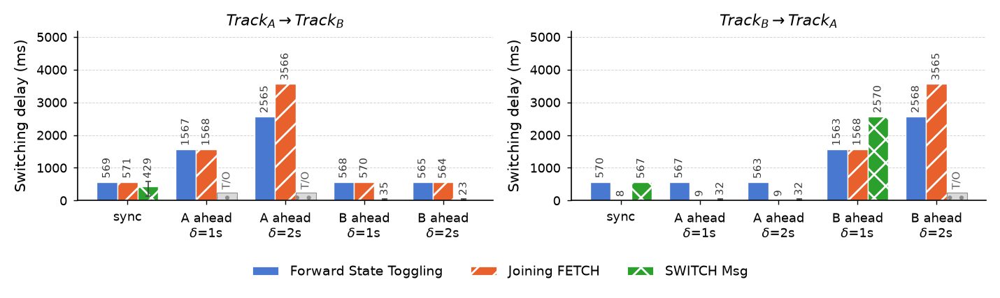
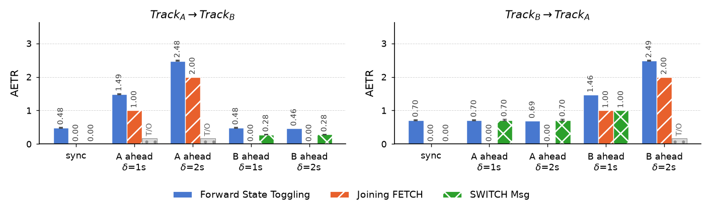

# MMSP26 Paper - Supplementary Material

Sequence diagrams and result plots for:

> **Zero Gap, Zero Waste: Subscriber-Initiated, Relay-Executed Track Switching in MOQ Transport**
> Zafer Gurel, Ali C. Begen (Ozyegin University); Saba Ahsan, Serhan Gül, Kashyap Kammachi-Sreedhar, Emre Aksu (Nokia Technologies)
> IEEE MMSP 2026

These figures were prepared for the paper and moved here for space. Everything shown is
generated from the same experiment output that produced the paper's tables.

---

## Sequence diagrams

`switching-methods.tex` draws the control-plane message flow of the three evaluated
methods: Forward State Toggling, Joining `FETCH`, and the `SWITCH` message.

Shading marks the window in which bytes that do not contribute to decodable playback of
the target track are delivered — the overlap of both tracks for Forward State Toggling,
and the `FETCH` warm-up for Joining `FETCH`. The `SWITCH` panel has no such window,
because the relay defers the whole transition to the group boundary. That difference is
what the AETR metric measures.

Build a standalone PDF:

```bash
pdflatex switching-methods.tex
```

## Result plots

Switching delay and AETR for the relative-position scenarios, in both switching
directions. These correspond to the switching-delay and AETR rows of Table III in the
paper.





Bars are means over the repetitions of each cell. **Whiskers span min–max**, so cells
where the repetitions disagree are visible directly — most are negligible, but the
`SWITCH` cell at `sync` in A→B is noticeably bimodal. `T/O` marks cells in which no
I-frame of the target track arrived within the observation window.

Vector PDF versions (`fig_delay_rp.pdf`, `fig_aetr_rp.pdf`) sit alongside the PNGs.

## MOQtail's implementation of the `SWITCH` message

The paper describes the relay-executed switch as four steps, the second of which opens a
`PUBLISH` stream for the target track. MOQtail implements that step differently, and the
paper notes this only in passing — the reasoning is here.

MOQtail implemented `SWITCH` **before** the `PUBLISH`-based delivery was proposed in
[moq-transport#1378](https://github.com/moq-wg/moq-transport/pull/1378). Rather than
opening a new `PUBLISH` stream for the target track, the relay synthesizes a `SUBSCRIBE`
message internally from the `SWITCH` message's fields and routes it through the standard
subscription pipeline. Objects then reach the subscriber over the per-track delivery
mechanism already established for that session.

**Why this does not affect any measured result.** The two approaches differ only in which
control message opens the delivery stream. Everything the paper measures is downstream of
that choice:

| Measured quantity        | Why it is unaffected                                                                        |
| ------------------------ | ------------------------------------------------------------------------------------------- |
| Switching delay          | The relay selects the switching point with the same boundary logic in both cases            |
| Stall / skipped duration | Both derive from which group the target track resumes at, which is the same switching point |
| AETR                     | The same objects are placed on the wire, so the byte counts are identical                   |

What would differ is the control-plane encoding of the delivery setup, which none of the
four metrics observes. When the mechanism settles in the draft — the proposal may still
change, or may not be adopted — MOQtail will implement the standardized form; this is
listed as future work in the paper.

## Measured data

`results/20260531_115720/` is the complete run behind every number in the paper —
18 scenarios × 3 methods × 3 repetitions = 162 runs.

| File                                    | Contents                                                                                                             |
| --------------------------------------- | -------------------------------------------------------------------------------------------------------------------- |
| `{method}_{scenario}_rep{n}.json`       | Per-run metrics: switching delay, stall, skipped duration, AETR, byte counts, control-message count, group positions |
| `{method}_{scenario}_rep{n}_events.csv` | Per-object event log: object, group, payload bytes, wall-clock and presentation timestamps                           |
| `experiment-metadata.json`              | Full parameter set and scenario list for the run                                                                     |
| `results.md`                            | Summary tables as produced by `summarize.py`                                                                         |

Method names in filenames are `switch`, `sub-update-forward` (Forward State Toggling)
and `joining-fetch`. Summarize them with:

```bash
python3 results/summarize.py results/20260531_115720
```

## Regenerating the plots

`make_charts.py` reads experiment output directly — no values are hardcoded, so the
figures cannot drift from the data.

```bash
pip install matplotlib
python3 make_charts.py results/20260531_115720 --out .
```

Given several directories, later ones override earlier ones for any (method, scenario)
cell they both contain, which is how a re-run with more repetitions is layered onto an
earlier matrix.

## Reproducing the measurements

The experiment harness is in this repository:

- `scripts/experiment.sh` — runs the method × scenario × repetition matrix
- `apps/client/EXPERIMENT_README.md` — testbed setup, metric definitions, CLI reference

Note that the publisher runs **on the relay host**, so ingest stays on loopback and
publisher-side jitter does not confound the downstream measurement. Moving the publisher
off the relay measurably changes the results.
